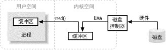
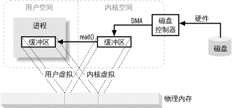
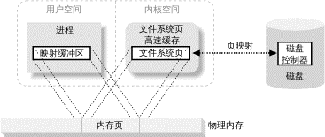
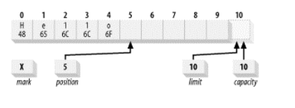

[TOC]

# JAVA NIO

### 一些概念

#### 缓冲区

“输入/输出”讲的无非就是把数据移进或移出缓冲区。

磁盘中的数据通过 DMA 操作搬移到内核空间的缓存区，装满之后，内核就把数据从内核空间的临时缓冲区拷贝到进程执行read()调用时指定的缓冲区。



为何先要拷贝到内核空间？

* 硬件通常不能直接访问用户空间
* 磁盘是基于块存储的设备，操作的是固定大小的数据块，而用户进程请求的可能是任意大小的或非对齐的数据块。内核负责数据的分解和组合操作。

#### 内核空间和用户空间

用户空间是常规进程所在区域。用户空间是非特权区域:比如,在该区域执行的代码就不能直接访问硬件设备。JVM就是常规进程。

内核空间是操作系统所在区域。内核代码有特别的权力:它能与设备控制器通讯,控制着用户区域
进程的运行状态,等等。

#### 虚拟内存

使用虚假(或虚拟)地址取代物理(硬件RAM)内存地址。

好处：

* 一个以上的虚拟地址可以指向同一个物理地址；
* 虚拟内存空间可大于实际可用的硬件内存。

把内核空间地址与用户空间的虚拟地址映射到同一个物理地址,这样,DMA 硬件(只能访问物理内存地址)就可以填充对内核与用户空间进程同时可见的缓冲区。



省去了内核空间和用户空间的往来拷贝，但是有前提条件：

* 内核和用户缓冲区使用相同的页对齐；
* 缓冲区的大小必须是磁盘控制器块大小(通常为512字节磁盘扇区)的倍数。

#### 内存页面调度

虚拟内存分页，为了支持虚拟内存的寻址空间大于物理内存的特性。虚拟内存空间的页面可以继续存在于外部磁盘存储，这样为物理内存中的其他虚拟页面腾出了空间。

所有磁盘I/O操作都在页层面完成。

页错误的产生：

* CPU引用某内存地址
* MMU(内存管理单元)确定该地址所在页，转换成物理页号
* 如果当前不存在与虚拟页形成有效映射的物理页，MMU向CPU提交一个页错误
* 页错误产生一个系统调用，控制权交给内核，附带导致错误的虚拟地址信息，内核采取步骤校验页的有效性。
  * 内核安排页面调入操作，把缺失的页内容读回物理内存。
  * 会导致别的页被移出物理内存，给新的页挪地方。此时如果待移出的页已经被碰过了(内容发生过改变)，还必须首先把内容拷贝到磁盘的分页区(页面调出操作)。
  * 如果地址不是有效的虚拟内存地址，那么该页不能通过验证，会产生段错误，此时控制权转交给内核的另一部分，通常的结果是该进程被强令关闭。
* 通过了验证之后，MMU随即刷新，建立该虚拟地址和物理地址的映射(如果有必要的话，中断移出页的映射)，用户进程得以继续进行，用户对此过程不会有任何感知。

#### 文件I/O

文件系统。是安排、解释磁盘数据的一种独特方式，定义了文件名、路径、文件、文件属性等抽象概念。文件系统将一连串大小一致的数据块组织到一起。这些数据块包括，目录、索引、文件数据、单个文件的元信息。

采用分页技术的操作系统执行I/O的全过程：

* 确定请求的数据分布在文件系统的哪些页(磁盘扇区组)。磁盘上的文件内容和元数据可能跨越多个文件系统页,而且这些页可能也不连续。
* 在内核空间分配足够数量的内存页,以容纳得到确定的文件系统页。
* 在内存页与磁盘上的文件系统页之间建立映射。
* 为每一个内存页产生**页错误**。(即将该页内容读入物理内存，并建立虚拟地址和物理地址的映射)
* 虚拟内存系统俘获页错误,安排页面调入,从磁盘上读取页内容,使页有效。
* 一旦页面调入操作完成,文件系统即对原始数据进行解析,取得所需文件内容或属性
  信息。


#### 内存映射文件

内存映射I/O，允许用户进程最大限度的利用面向页的系统I/O特性，并完全摒弃缓冲区拷贝。内存映射I/O使用文件系统建立从用户空间直到可用文件系统页的虚拟内存映射，这样的好处：

* 用户进程把文件数据当作内存,所以无需发布 read( )或 write( )系统调用。
* 当用户进程碰触到映射内存空间,页错误会自动产生,从而将文件数据从磁盘读进内存。如果用户修改了映射内存空间,相关页会自动标记为脏,随后刷新到磁盘,文件得到更新。
* 操作系统的虚拟内存子系统会对页进行智能高速缓存,自动根据系统负载进行内存管理。
* 数据总是按页对齐的,**无需执行缓冲区拷贝**。
* 大型文件使用映射,无需耗费大量内存,即可进行数据拷贝。



**虚拟内存和磁盘I/O紧密相连**，如果数据缓冲区是按页对齐的，且大小是内建页大小的的倍数，那么，对于大圩偶数操作系统而言，处理效率会大幅提升。

#### 文件锁定

文件锁定机制允许一个进程阻止其他进程存取文件，或限制其存取方式。通常的用途是控制共享信息的更新方式或用于事务隔离。数据库就严重依赖于文件锁定。

文件锁定与特定文件相关，开始于文件的某个特定字节地址，包含特定数量的连续字节。这对于协调多个进程互不影响地访问文件不同区域至关重要。

共享锁和独占锁。

文件锁分建议使用和强制使用：

* 建议型文件锁会向提出请求的进程提供当前锁定信息，由相关进程进行协调并关注锁定信息。
* 强制型锁由操作系统或者文件系统强制实施，不管进程对锁的存在知道与否，都会阻止其对文件锁定区域的访问。(Windows使用的强制型锁)

#### 流I/O

上述的I/O是基于块的，也有流I/O，其原理模仿了通道。I/O字节流必须顺序存取，常见的例子是网络连接。

流的传输一般比块设备慢，经常用于间歇性输入。

多数操作系统允许把流置于非块模式，这样，进程可以查看流上是否有输入，即使没有也不影响干别的（这个是否说明，块模式会影响进程干别的）-> 再有输入的时候进行处理，输入流闲置的时候执行其他功能。

非块模式更进一步->就绪性选择，它和非块模式类似，只是把查看流是否就绪的任务交给了操作系统。操作系统受命查看一系列流，并提醒进程哪些流已经就绪。凭借操作系统返回的就绪信息，进程可以使用相同代码和单一线程实现多活动流的多路传输。

## 缓冲区

### 缓冲区基础

缓冲区是包在一个对象内的基本数据元素数组。

* 容量(Capacity)

  缓冲区能够容纳的数据元素的最大数量。这一容量在缓冲区创建时被设定,并且永远不能
  被改变。

* 上界(Limit)
  缓冲区的第一个不能被读或写的元素。或者说,缓冲区中现存元素的计数。
* 位置(Position)
  下一个要被读或写的元素的索引。位置会自动由相应的 get( )和 put( )函数更新。
* 标记(Mark)
  一个备忘位置。调用 mark( )来设定 mark = postion。调用 reset( )设定 position =
  mark。标记在设定前是未定义的( undefined) 。
  这四个属性之间总是遵循以下关系:
  0 <= mark <= position <= limit <= capacity



#### 翻转

flip()函数能将一个能继续添加数据元素的填充状态的缓冲区翻转成一个准备读出元素的释放状态。

实际上，这种操作内部即是把上界置为position的位置，并把position置为0

#### 压缩

compact()函数丢弃已经释放的数据,保留未释放的数据，并使缓冲区对重新填充容量准备就绪。

#### 标记

mark()函数被调用之前是未定义的，调用时标记为当前位置的值。

reset()函数将position设置为当前标记的值，如果标记值未定义，会抛出InvalidMarkException。

```java
//从缓冲区获取数据
char [] smallArray = new char [10];
while (buffer.hasRemaining( )) {
    int length = Math.min (buffer.remaining( ), smallArray.length);
    buffer.get (smallArray, 0, length);
    processData (smallArray, length);
}
```


### 创建缓冲区

由分配或者包装操作创建。

* 分配操作创建一个缓冲区对象并**分配**一个私有的空间来存储容量大小的数据元素。
* 包装操作创建一个缓冲区对象但是**不分配**任何空间来存储数据元素。使用已经提供的数组来作为存储空间。(对数组的直接操作对缓冲区对象可见)

### 复制缓冲区

视图缓冲区，用来管理其他缓冲器所包含的数据元素。

duplicate()函数创建一个和原始缓冲区相似的新缓冲区。两个缓冲区共享数据元素，拥有同样的容量，但每个缓冲区拥有各自的位置，上界和标记属性。

slice()同样共享数据元素。

### 字节缓冲区

IP协议使用了大端的网络字节顺序。所有IP分组报文的写一部分中使用的多字节数值必须先在本机字节顺序和网络字节顺序转换。

ByteOrder封装了字节顺序。

缓冲区类可以通过order()查询当前字节顺序设定。只有ByteBuffer可以通过order(ByteOrder bo)改变字符顺序。

通道只接收ByteBuffer作为参数。

### 直接缓冲区

* 直接缓冲区用于通道和固有I/O例程交互。
* 会花费更高的成本，直接缓冲区使用的内存是通过调用本地操作系统方面的代码分配的，绕过了标准JVM堆栈。建立和销毁直接缓冲区会明显比具有堆栈的缓冲区破费，不会由GC支配。
* 直接ByteBuffer产生：ByteBuffer.allocateDirect()函数。用wrap函数创建的被包装的缓冲区是非直接的。

I/O操作的目标内存区域必须是连续的字节序列。在JVM中，字节数组可能不会在内存中连续存储，或者垃圾收集器可能经常对其进行移动。

假如向通道传递一个非直接ByteBuffer对象，通道可能会在每次调用时隐含进行下面的操作：

* 1.创建一个临时的直接 ByteBuffer 对象。
* 2.将非直接缓冲区的内容复制到临时缓冲中。
* 3.使用临时缓冲区执行低层次 I/O 操作。
* 4.临时缓冲区对象离开作用域,并最终成为被回收的无用数据。

### 视图缓冲区

通过已存在的缓冲区对象实例的工厂方法来创建。这种视图对象维护它自己的属性,容量,位置,上界和标记,但是和原来的缓冲区共享数据元素。

当直接从 byte 型缓冲区中采集数据时,视图换冲突拥有提高效率的潜能。如果这个视图的字节顺序和本地机器硬件的字节顺序一致,低等级的(相对于高级语言而言)语言的代码可以直接存取缓冲区中的数据值,而不是通过比特数据的包装和解包装过程来完成。

### 内存映射缓冲区

MappedByteBuffer

通过内存映射来存取数据元素的字节缓冲区，带有存储在文件中的数据元素。映射缓冲区通常是直接存取内存，可以通过FileChannel创建。

和直接缓冲区类似，但是可以处理独立于文件存取形式的许多特定字符。


## 通道

Channel用于在字节缓冲区和另一侧的实体(一个文件或者一个套接字)之间有效的传输数据。

多数情况下，通道和操作系统的文件描述符(File Decriptor)和文件句柄(File Handle)有着一对一的关系。多数通道都是连接到开放的文件描述符的。

缓冲区是通道内部用来发送和接受数据的端点。

通道充当连接I/O服务的导管。

### 通道基础

通道API主要由接口指定，缓冲区由类制定。

InterruptibleChannel是一个标记接口，标示该通道是可中断的。如果连接可中断通道的线程被中断，那么通道会以特别的方式工作。

从Channel引申出来的其他接口都是面向字节的子接口----WritableByteChannel和ReadableByteChannel-----通道只能在字节缓冲区上操作。

有两个类AbstractInterruptibleChannel(为可中断的通道提供常用方法)和AbstractSelectableChannel(可选择的通道提供所需的方法)位于java.nio.channels.spi包。SPI包允许新通道实现以一种受控且模块化的方式植入到Java虚拟机中。

#### 打开通道

Socket通道(SocketChannel、ServerSocketChannel、DatagramChannel)有可以直接创建新Socket通道的工厂方法(open函数)。

FileChannel只能通过一个打开的RandomAccessFile、FileInputStream、FileOutputStream对象上调用getChannel方法获取。

Socket类也有getChannel()方法，可以返回一个相应的Socket通道对象，但是并非新通道的来源，RandomAccessFile.getChannel( )方法才是。因为只有已经存在通道时，它们才返回，它们不会创建新通道。

#### 使用通道

从FileInputStream对象的getChannel()方法获取的FileChannel对象是只读的，不过从接口声明的角度来看却是双向的，因为FileChannel实现ByteChannel接口。在这个通道上调用write()会抛NonWritaleChannelException异常，FileInputStream对象总以read-only的权限打开文件。----根据底层文件句柄的访问模式,通道实例可能不允许使用 read()或 write()方法。

```java
public class ChannelCopy
{
    /**
     * This code copies data from stdin to stdout. Like the 'cat'
     * command, but without any useful options.
     */
    public static void main (String [] argv)
            throws IOException
    {
        ReadableByteChannel source = Channels.newChannel (System.in);
        WritableByteChannel dest = Channels.newChannel (System.out);
        channelCopy1 (source, dest);
// alternatively, call channelCopy2 (source, dest);
        source.close( );
        dest.close( );
    }
    /**
     * Channel copy method 1. This method copies data from the src
     * channel and writes it to the dest channel until EOF on src.
     * This implementation makes use of compact( ) on the temp buffer
     * to pack down the data if the buffer wasn't fully drained. This
     * may result in data copying, but minimizes system calls. It also
     * requires a cleanup loop to make sure all the data gets sent.
     */
    private static void channelCopy1 (ReadableByteChannel src,
                                      WritableByteChannel dest)
            throws IOException
    {
        ByteBuffer buffer = ByteBuffer.allocateDirect (16 * 1024);
        while (src.read (buffer) != -1) {
// Prepare the buffer to be drained
            buffer.flip( );
// Write to the channel; may block
            dest.write (buffer);
// If partial transfer, shift remainder down
// If buffer is empty, same as doing clear( )
            buffer.compact( );
        }
// EOF will leave buffer in fill state
        buffer.flip( );
// Make sure that the buffer is fully drained
        while (buffer.hasRemaining( )) {
            dest.write (buffer);
        }
    }
    /**
     * Channel copy method 2. This method performs the same copy, but
     * assures the temp buffer is empty before reading more data. This
     * never requires data copying but may result in more systems calls.
     * No post-loop cleanup is needed because the buffer will be empty
     * when the loop is exited.
     */
    private static void channelCopy2 (ReadableByteChannel src,
                                      WritableByteChannel dest)
            throws IOException
    {
        ByteBuffer buffer = ByteBuffer.allocateDirect (16 * 1024);
        while (src.read (buffer) != -1) {
// Prepare the buffer to be drained
            buffer.flip( );
// Make sure that the buffer was fully drained
            while (buffer.hasRemaining( )) {
                dest.write (buffer);
            }
// Make the buffer empty, ready for filling
            buffer.clear( );
        }
    }
}
```

通道的阻塞和非阻塞模式：

* blocking：
* nonblocking：永远不会让调用的线程休眠，请求的操作要么立即完成，要么返回一个结果表明未进行任何操作。只有面向流的(stream-oriented)通道，如Socket和pipes才能使用非阻塞模式。

Socket通道从SelectableChannel引申而来，因此可以支持**有条件的选择的选择器**一起使用。

将非阻塞I/O和选择器组合起来可以实现多路复用I/O。

### 关闭通道

缓冲区可以重复使用，通道不能重复使用。

一个打开的通道代表与一个特定的I/O服务的特有连接，并封装该连接的状态。

通道关闭时，连接会丢失，然后通道不再连接任何东西。

close()方法，可能导致在通道关闭底层I/O服务的过程中线程暂时阻塞（Socket通道的关闭会花费较长时间，取决于具体网络实现），即便通道处于非阻塞模式，该阻塞行为取决于操作系统或者文件系统。

一个实现了InterruptibleChannel接口的 通道：

如果一个线程在一个通道上被阻塞并且同时被中断(由另一个线程，调用该阻塞线程的Interrupt()方法)，那么该通道将会关闭，该被阻塞线程也会产生一个ClosedByInterruptException。

Channels上休眠的线程被中断时，会关闭通道；Selectors上休眠的线程被中断时，不会关闭通道，Interrupt status会被设置，假如此时又访问一个Channel，那么该通道会被关闭。

为什么休眠在通道上的线程被中断就关闭通道？因为在所有的操作系统上一致地处理被中断的I/O操作是不可能的。

可中断的通道也可以是异步关闭的，即使有其他阻塞的线程在等待通道上的I/O操作。当一个通道关闭时，休眠在该通道上的所有线程都将被唤醒并接受到一个AsynchrinousCloseException异常。

不实现 InterruptibleChannel 接口的通道一般都是不进行底层本地代码实现的有特殊用途的通道。

### Scatter/Gather（矢量I/O）

从多个缓冲区实现一个简单的I/O操作。由操作系统提供支持，避免来回移动数据。

* write操作，从几个缓冲区按顺序抽取数据并沿着通道发送，gather。
* read操作，从通道读取的数据会按顺序散步到多个缓冲区，将每个缓冲区填满直至通道中的数据或者缓冲区的最大空间被消耗完。

带有offset和length参数版本的read()和write()方法使得可以使用缓冲区阵列的子集的缓冲区，offset指定从哪个缓冲区开始，而不是指数据的offset；length知识使用的缓冲区数量。

### 文件通道（FileChannel）

* 文件通道总是阻塞式的，不能被置于非阻塞模式
* 文件I/O的最强大支出在于异步I/O，允许一个进程从操作系统请求一个或多个I/O操作而不必等待这些操作的完成。发起请求的进程之后会收到它请求的I/O操作已完成的通知。
* FileChannel是线程安全的，多个进程可以在同一个实例上并发调用方法，不会有任何问题。不过如果一个线程在执行影响通道位置或者文件大小的操作时，其他尝试类似操作时便会阻塞。
* 保证一个Java虚拟机上的所有实例看到的某个文件的视图均是一致的。

文件空洞：

当磁盘上一个文件的分配空间小于它的文件大小时会出现文件空洞。对于稀疏文件，文件系统只为实际写入的数据分配磁盘空间。加入数据被写入到文件中非连续的位置上，导致文件出现在逻辑上不包含数据的区域。

* FileChannel位置(position)是从底层的文件描述符获得的，该position同时被作为通道引用获取来源的文件对象共享。这意味着一个对象对position的更新可以被另一个对象看到。
* position值到达文件大小的值时，如果正在执行的是read方法，会返回文件尾条件值(-1)；如果正在执行的是write方法，该文件会扩展以容纳新写入的字节。
* 带有position参数的绝对形式的read和write方法不会改变文件的position，它把操作请求委托给本地代码，每次调用是原子性的，因此可以并发访问一个文件，

truncate()方法会砍掉指定的新size值之外的所有数据。

* 当前size>新size，超出新size的字节都会被丢弃
* 反之，文件不会被修改

两种情况下，文件的position都会设置成提供的新size值。

force()方法会告诉通道强制将所有待定的修改都应用到磁盘中。文件系统都会缓存数据和延迟磁盘文件更新以提高性能。force要求文件的更改立即同步到磁盘。

* boolean参数表明文件的元数据是否也需要同步更新到磁盘。元数据指文件所有者、访问权限、最后一次修改时间。会消耗额外一次I/O。


### 文件锁

锁的对象是文件而不是通道或者线程。旨在进程级别上判断优先级访问。如果需要控制多个Java线程的并发访问，需要实现自己的锁定方案。

锁与一个文件关联，而不是和单个的文件句柄或者通道关联。

* 尽管FileLock与特定的FileChannel关联，但是它所代表的锁和底层文件关联，而不是和通道关联。
* 共享锁的范围在单个进程之内，假如两个线程运行在不同的Java虚拟机上，都来请求共享锁，是会被阻塞的。

### 内存映射文件

map()方法会创建一个由磁盘文件支持的虚拟内存映射(virtual memory mapping)，并在虚拟内存空间外部封装一个MappedByteBuffer对象。

通过内存映射机制来访问一个文件会比常规方法读写高效很多。

* 参数：mode、position、size
* 与文件锁的范围机制不同，映射文件的范围不应超过文件的实际大小。如果请求一个超过文件大小的映射，文件会被增大以匹配映射的大小。如果是只读映射，会抛出IOException。

MappedByteBuffer在行为方面类似于一个基于内存的缓冲区，但是该对象的数据元素存储在磁盘中的一个文件中。

一个映射一旦建立之后将保持有效，直至GC。映射缓冲区没有绑定到创建它的通道上(锁绑定了)，关闭相关联的Channel不会破坏映射。

MappedByteBuffer对象是直接的，它们占用的内存空间位于虚拟机内存堆之外。

copy on write--写时拷贝，产生拷贝，不对原数据更改，GC之后，修改就丢失了。允许父进程和子进程共享内存页直到它们中的一方实际发生修改行为。

使用MAP_MODE.PRIVATE模式创建的MappedByteBuffer调用put方法时，会产生一个页拷贝，注意单位是页，这个页拷贝是不受本地文件修改的影响的，但是出了这个页的部分还是会受到影响。

#### Channel-To-Channel传输

transferTo()和transferFrom()允许将一个通道交叉连接到另一个通道，中间不需要中间缓冲区，但是只有FileChannel有这个方法，表明传输过程中必须有一通道是FileChannel。

直接的通道传输不会更新Position值。

某些操作系统可以不通过用户空间而进行直接的数据传输。

### Socket通道

全部 socket 通道类(DatagramChannel、SocketChannel 和 ServerSocketChannel)在被实例化时
都会创建一个对等 socket 对象。

Socket 通道委派协议操作给对等 socket 对象。如果在通道类中存在似乎重复的 socket 方法,那么将有某个新的或者不同的行为同通道类上的这个方法相关联。

#### 非阻塞模式

configureBlocking( false)

可以通过blockingLock获取一个锁，拥有该锁的线程才能更改通道的阻塞模式。

#### ServerSocketChannel

基于通道的Socket监听器。

ServerSocketChannel没有bind()函数，有必要取出对等的Socket并使用它绑定一个端口开始监听。

以非阻塞调用时，当没有传入连接在等待时，ServerSocketChannel.accept()会立即返回null，因此可以实现可选择性。可以通过使用一个选择器实例来注册一个ServerSocketChannel对象以实现新连接到达时自动通知的功能。

#### SocketChannel

虽然每个 SocketChannel 对象都会创建一个对等的 Socket 对象,反过来却不成立。直接创建的 Socket 对象不会关联 SocketChannel 对象,它们的getChannel( )方法只返回 null。

在SocketChannel上没不能设置connect()方法的额超时值。运行在非阻塞模式下下时，SocketChannel提供并发连接：它发起对请求地址的连接并且立即返回值——如果是true，表明已经建立了连接；false，不能立即建立连接，connect方法会返回false且并发地继续连接建立过程。

isConnectPending() 返回true，表明某个SocketChannel上正有一个并发连接。

SocketChannel是线程安全的，并发访问时无需特别措施来保护发起访问的多个线程，任何时候都只有一个读操作和一个写操作在进行中。它们可以保证发送的字节会按照顺序到达但无法承诺维持字节分组。

connect( )和 finishConnect( )方法是互相同步的,并且只要其中一个操作正在进行,任何读或写的方法调用都会阻塞,即使是在非阻塞模式下。

#### DatagramChannel

SocketChannel模拟连接导向的流协议(TCP/IP)，DatagramChannel模拟包导向的无连接协议(UDP/IP)。

DatagramChannel既可以充当服务器也可以充当客户端。

* 如果希望新创建的通道负责监听，通道必须被绑定到一个端口或者地址端口/组合上。有bind()函数。

无连接的，每个数据报都是一个自包含的实体，拥有它自己的目的地址，不依赖于其他数据报。可以发送单独的数据报给不同的目的地址。

一个未绑定的DatagramChannel仍能接受数据包。当一个底层Socket被创建时，一个动态生成的端口号即会分配给它。绑定行为指端口设置成特定的值。不论通道是否绑定，所有发送的包都含有DatagramChannel的源地址(带端口号)。未绑定的DatagramChannel可以接受发送给它的包。已绑定的通道接受发送给它们所绑定的熟知端口(wellknown port)的包。

connect()的含义是只能接受连接一侧的包，只能发送包给连接一侧。

适合数据报Socket的理由：

* 您的程序可以承受数据丢失或无序的数据。
* 您希望“发射后不管”(fire and forget)而不需要知道您发送的包是否已接收。
* 数据吞吐量比可靠性更重要。
* 您需要同时发送数据给多个接受者(多播或者广播)。
* 包隐喻比流隐喻更适合手边的任务。

### 管道

两个实体间单向传输的导管。

Unix系统中，管道用来连接一个进程的输入和另一个进程的输入。

Pipe类创建一对提供环回机制的Channel对象。这两个通道的远端是连接起来的，以便任何写在SinkChannel对象上的数据都能出现在SourceChannel上。Pipe创建时会同时创建SourceChannel和SinkChannel。

管道可以被用来仅在同一个 Java 虚拟机内部传输数据。虽然有更加有效率的方式来在线程之
间传输数据,但是使用管道的好处在于封装性。


## 选择器

提供选择执行已经就绪的任务的能力。

选择器会记住关心的通道，并追踪是否已经就绪。调用选择器的select()方法时，相关的键会被更新。可以获取一个键的集合，从而找到当时已经就绪的通道。

选择器提供了询问通道是否已经准备好执行每个I/O操作的能力。

就绪选择：大量的通道可以同时进行就绪状态的检查，调用者可以轻松决定多个通道中的哪一个准备好要运行。

* 被激发的线程可以处于休眠状态，直到一个或者多个注册到选择器的通道就绪。
* 或者周期性的轮询选择器，看看上次检查之后，是否有通道处于就绪状态。

传统的监控多个Socket的Java解决方案：

* 为每一个Socket创建一个线程并使得线程可以在read()调用中阻塞，直到数据可用。
* 事实上是将每个被阻塞的线程当做了Socket监控器，并将java虚拟机的线程调度当做了通知机制。

真正的就绪选择必须由操作系统来做。操作系统最重要的功能是处理I/O请求并通知各个线程它们的数据已经准备好了。选择器提供了这种抽象，使得Java代码可移植的 请求操作系统提供就绪选择服务。

用于就绪选择的零部件：

* 选择器(Selector)：管理一个被注册的通道集合的信息和它们的就绪状态；
* 可选择通道(SelectableChannel)：提供了实现通道的可选择性所需要的公共方法；支持就绪检查通道类的父类。FileChannel对象是不可选择的，阻塞的；所有Socket通道都是可以选择的，包括从管道(Pipe)对象中获取的通道。SelectableChannel可以注册到Selector对象上，一个通道可以被注册到多个选择器上，但每个选择器都只能注册一次。
* 选择键(SelectionKey)：封装了特定的通道和特定的选择器的注册关系。选择键对象被SelectableChannel.register()返回并提供一个表示这种注册关系的标记。选择键包含了两个比特集，指示了该注册关系所关心的通道操作，以及通道已经准备好的操作。

通道在被注册到一个选择器上之前，必须设置成非阻塞模式。如果尝试注册一个处于阻塞状态的通道，register()将抛出未检查的IllegalBlockingModeException异常。通道一旦注册，就不能回到阻塞状态。

一个给定的通道可以被注册到多余一个的选择器上，而且不需要知道它被注册了哪个Selector对象上。register()将返回一个封装了两个对象的关系的选择键对象。------选择器对象控制了注册到它上面的通道的选择过程。

选择键的interest集合和ready集合的解释是和特定的通道相关的。每个通道的实现，都定义它自己的选择键类。

### 1. 建立选择器

* 静态工厂方法open()，它向SPI发出请求，通过默认的SelectorProvider获取一个新的实例；
* 可以通过provider方法决定哪个SelectorProvider创建实例，通常情况下不需要关心这个。

四种可选择操作：read、write、connect、accept。

* Socket不支持accept；可以通过validOps()方法来获取特定的通道所支持的操作集合。

一个单独的通道可以注册到多个选择器上。isRegistered()检查有没有注册到一个选择器上。

任何一个通道和选择器的注册关系都封装在一个SelectionKey对象上。keyFor()返回与该通道和指定选择器相关的键。

### 2. 使用选择键

一个键表示了一个特定的通道对象和一个特定的选择器对象之间的注册关系。

一个SelectionKey对象包含两个以整数形式进行编码的比特掩码：用于指示那些通道/选择器组合体所关心的操作(interest集合)，以及通道准备好要执行的操作(ready集合)。

SelectionKey对象包含的ready集合与最近一次选择器对所注册的通道所作的检查相同。而每个单独的通道的就绪状态会同时改变。

attach()方法允许您在键上放置一个“附件”，并在后面获取它。这是一种允许您将任意对象与键关联的便捷的方法。

SelectionKey对象是线程安全的，修改interest集合的操作是通过Selector对象进行同步的。

### 3. 使用选择器

#### 1. 维护的集合

选择器维护着注册过的通道的集合，并且这些注册关系中的任意一个都封装在SelectionKey对象中。

* Registered key set：与选择器关联的已经注册的键的集合。通过keys()返回。
* Selected key set：每个成员都是相关的通道被选择器判断为已经准备好的，并且包含于键的interest集合中的操作。通过selectedKeys()返回。
  * 和ready集合不同，这是一个键的集合，每个键都关联了一个已经准备好至少一个操作的通道。每个键都有内嵌的ready集合，指示所关联的通道已经准备好的操作。
  * 键可以从这个集合删除，但不能添加。添加会抛异常。
* Canceled key set：包含了cancel()方法被调用过的键，但它们还没被注销。

选择器是对select()、poll()等本地调用或者类似的操作系统特定的系统调用的一个包装。但它所做的不仅仅是简单的向本地代码传递参数。它对每个选择器应用了特定的过程。

#### 2. 选择过程

不管是执行哪种select()函数，下列步骤将执行：

* 已取消的键的集合将会被检查；如果它是非空的，每个已取消的键的集合中的键将从另外两个集合中移除，并且相关的通道将被注销。这个步骤结束后，已取消的键的集合将是空的。
* 已注册的键的集合中的键的interest集合将被检查。在这个步骤中的检查执行过后，对interest集合的改动不会影响剩余的检查过程。对于那些操作系统指示已经准备好interest集合中的一种操作的通道：
  * 如果通道的键还没有处于已选择的键的集合中，那么键的ready集合将被清空，然后表示操作系统发现的当前通道已经准备好的操作的比特掩码将被设置。
  * 否则，也就是键在已选择的键的集合中。键的ready集合将被表示操作系统发现的当前已经准备好的操作的比特掩码更新。所有之前的已经不再是就绪状态的操作不会被清除。
* 步骤2可能会花费很长时间，特别是所激发的线程处于休眠状态时。与该选择器相关的键可能会同时被取消。当步骤2结束时，步骤1将重新执行，以完成任意一个在选择进行的过程中，键已经被取消的通道的注销。
* select操作返回的值是ready集合在步骤2中被修改的键的数量，而不是已选择的键的集合中的通道的总数。返回值不是已准备好的通道的总数，而是从上一个select( )调用之后进入就绪状态的通道的数量。之前的调用中就绪的，并且在本次调用中仍然就绪的通道不会被计入，而那些在前一次调用中已经就绪但已经不再处于就绪状态的通道也不会被计入。这些通道可能仍然在已选择的键的集合中，但不会被计入返回值中。返回值可能是0。

#### 3. 停止选择过程

* wakeup()

使得选择器上的第一个还没有返回的选择操作立即返回。如果当前没有在进行中的选择，那么下一次对select( )方法的一种形式的调用将立即返回。后续的选择操作将正常进行。

* close( )

选择器的close( )方法被调用，那么任何一个在选择操作中阻塞的线程都将被唤醒，就像wakeup( )方法被调用了一样。与选择器相关的通道将被注销，而键将被取消。

* interrupt( )

睡眠中的线程的interrupt( )方法被调用，它的返回状态将被设置。如果被唤醒的线程之后将试图在通道上执行I/O操作，通道将立即关闭，然后线程将捕捉到一个异常。Selector对象将捕捉InterruptedException异常并调用wakeup( )方法。

注意这些方法中的任意一个都不会关闭任何一个相关的通道。中断一个选择器与中断一个通道是不一样的。选择器不会改变任意一个相关的通道，它只会检查它们的状态。当一个在select( )方法中睡眠的线程中断时，对于通道的状态而言，是不会产生歧义的。

#### 4. 管理选择键

一旦一个选择器将一个键添加到它的已选择的键的集合中，它就不会移除这个键。并且，一旦一个键处于已选择的键的集合中，这个键的ready集合将只会被设置，而不会被清理。

合理地使用选择器的秘诀是理解选择器维护的选择键集合所扮演的角色。

#### 5. 并发性

选择器对象是线程安全的，但它们包含的键集合不是。通过keys( )和selectKeys( )返回的键的集合是Selector对象内部的私有的Set对象集合的直接引用。

如果您期望在多个线程间共享选择器和/或键，请对此做好准备。您可以直接修改选择键，但请注意您这么做时可能会彻底破坏另一个线程的Iterator。Iterator对象是快速失败的(fail-fast)：如果底层的Set被改变了，它们将会抛出java.util.ConcurrentModificationException。

### 异步关闭

任何时候都有可能关闭一个通道或者取消一个选择键。除非您采取步骤进行同步，否则键的状态及相关的通道将发生意料之外的改变。一个特定的键的集合中的一个键的存在并不保证键仍然是有效的，或者它相关的通道仍然是打开的。

当一个通道关闭时，它相关的键也就都被取消了。这并不会影响正在进行的select( )，但这意味着在您调用select( )之前仍然是有效的键，在返回时可能会变为无效。

您总是可以使用由选择器的selectKeys( )方法返回的已选择的键的集合：请不要自己维护键的集合。

如果您试图使用一个已经失效的键，大多数方法将抛出CancelledKeyException。但是，您可以安全地从从已取消的键中获取通道的句柄。如果通道已经关闭时，仍然试图使用它的话，在大多数情况下将引发ClosedChannelException。

### 选择过程的可扩展性

使用一个线程来为多个通道提供服务，通过消除管理各个线程的额外开销，可能会降低复杂性并可能大幅提升性能。

对单CPU的系统而言这可能是一个好主意，因为在任何情况下都只有一个线程能够运行。通过消除在线程之间进行上下文切换带来的额外开销，总吞吐量可以得到提高。但对于一个多CPU的系统呢？在一个有n个CPU的系统上，当一个单一的线程线性地轮流处理每一个线程时，可能有n-1个cpu处于空闲状态。

解决策略：

* 不要使用多个选择器，在大量通道上执行就绪选择并不会有很大的开销，大多数工作是由底层操作系统完成的。管理多个选择器并随机地将通道分派给它们当中的一个并不是这个问题的合理的解决方案。这只会形成这个场景的一个更小的版本。
* 一个更好的策略是对所有的可选择通道使用一个选择器，并将对就绪通道的服务委托给其他线程。
  * 只用一个线程监控通道的就绪状态并使用一个协调好的工作线程池来处理接收到的数据。

单线程的话，可能会造成阻塞，很多命令不得不在队列中等待，有一些服务，响应时间很重要，如操作命令。因此，需要某些通道要求比其他通道更高的响应速度。

解决策略，两种：

* 通过使用两个选择器来解决
  * 一个为命令连接服务；
  * 一个为普通连接服务。
* 也可以使用与第一个场景十分相似的办法来解决。与将所有准备好的通道放到同一个线程池的做法不同，通道可以根据功能由不同的工作线程来处理。它们可能可以是日志线程池，命令/控制线程池，状态请求线程池，等等。


由于执行选择过程的线程将重新循环并几乎立即再次调用select( )，键的interest集合将被修改，并将interest（感兴趣的操作）从读取就绪(read-rreadiness)状态中移除。这将防止选择器重复地调用readDataFromSocket( )（因为通道仍然会准备好读取数据，直到工作线程从它那里读取数据）。当工作线程结束为通道提供的服务时，它将再次更新键的ready集合，来将interest重新放到读取就绪集合中。它也会在选择器上显式地嗲用wakeup( )。如果主线程在select( )中被阻塞，这将使它继续执行。这个选择循环会再次执行一个轮回（可能什么也没做）并带着被更新的键重新进入select( )。