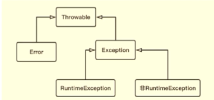

# 中断

Java中没有一种安全的抢占式方法来停止线程。

一种协作机制是设置已请求取消标志，任务将定期查看该标志。

调用interrupt()方法，通知线程应该中断了。

* 如果线程处于被阻塞状态，那么线程将立即退出被阻塞状态，并且抛出一个InterruptedException；
* 如果线程处于正常活动状态，那么会将该线程的中断标志设置为true。被设置中断标志的线程将继续正常运行，不受影响。

如何中断线程：

* 在正常运行任务时，经常检查本线程的中断标志位，如果被设置了中断标志就自行停止线程；
* 如果线程处于正常活动状态，那么会将该线程的中断标志设置为true。被设置中断标志的线程将继续正常运行，不受影响。

# 反射

对于任意一个类，都能够知道这个类的所有属性和方法；

对于任意一个对象，都能调用它的任意方法和属性；

这种动态获取信息以及动态调用对象方法的 功能称为java语言的反射机制。

getDeclearedMethod，可以获取该类的所有方法，但是不能获取父类的方法。

getMethod，可以获取所有的public方法，包括父类的public方法；

# 异常

Error和Exception的区别：是否可以处理的错误。

RuntimeException：不可预知的，程序应该负担的责任。

CheckedException可检查异常是Java编译器应该负担的责任。

常见Error以及Exception

RuntimeException：

* NullPointerException-空指针引用异常
* ClassCastException-类型强制转换异常
* IllegalArgumentException-传递非法参数异常
* IndexOutOfBoundsException-数字格式异常
* NumberFormatException-数字格式异常

非RuntimeException：

* ClassNotFoundException-找不到指定class的异常
* IOException-IO操作异常

Error：

* NoClassDefFoundError-找不到class定义的异常
  * 类依赖的class或者jar不存在
  * 类文件存在，但是存在不同的域中（如多个类加载器加载了同一个类）
  * 大小写问题
* StackOverFlowError-深递归导致栈耗尽而抛出的异常
* OutOfMemoryError-内存溢出异常

finally块是先于catch块中的return执行的，假如catch中也有return，那么catch中的return将不会被执行。

Java异常的处理原则：

* 具体明确：抛出的异常应该能通过异常类名和message准确说明异常的类型和产生异常的原因；
* 提前抛出：应尽可能早的发现并抛出异常，以便精确定位问题；
* 延迟捕获：异常的捕获和处理应尽可能延迟，已掌握更多信息的作用域来处理异常。

Java异常处理会消耗性能

* try-catch块会影响JVM的优化；
* 异常对象实例需要保存栈快照等信息，开销较大。

不要用一个大try包去包住代码段，try里面只放必要的代码段；

不要用异常控制代码流程

# synchronized

