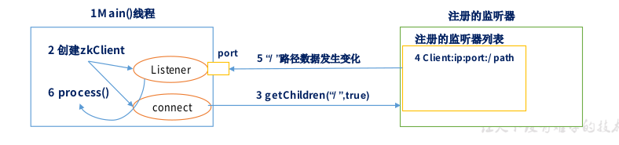
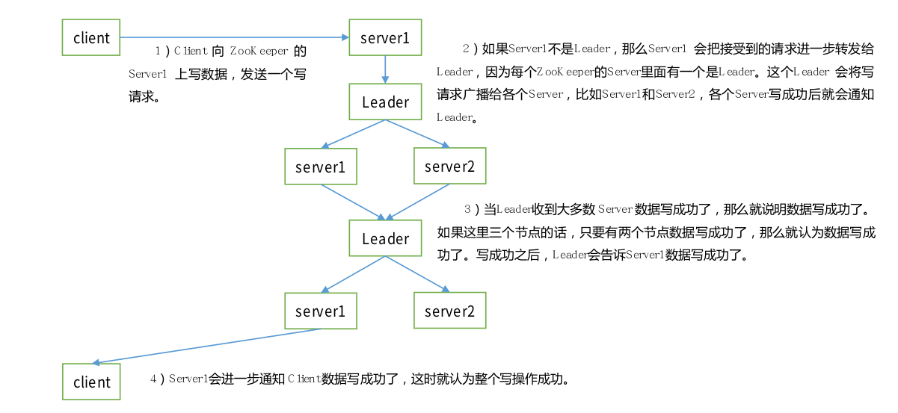
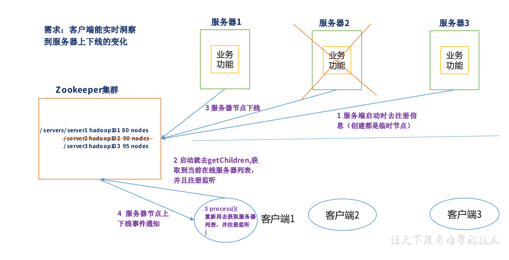

# Zookeeper

文件系统+通知机制

## 特点

1)Zookeeper:一个领导者(Leader),多个跟随者(Follower)组成的集群。
2)集群中只要有半数以上节点存活,Zookeeper集群就能正常服务。
3)全局数据一致:每个Server保存一份相同的数据副本,Client无论连接到哪个Server,数据都是一致的。
4)更新请求顺序进行,来自同一个Client的更新请求按其发送顺序依次执行。
5)数据更新原子性,一次数据更新要么成功,要么失败。
6)实时性,在一定时间范围内,Client能读到最新数据。

统一命名服务，对服务和应用进行统一命名。

统一配置管理，配置文件同步非常常见，配置信息写入一个zookeeper的Znode，各个客户端监听这个Znode

统一集群管理，实时掌握各个节点的状态

服务器动态上下线

软负载均衡，在Zookeeper中记录每台服务器的访问数，让访问数最少的服务器去处理最新的客户端请求。

## 配置参数

心跳：2000ms

initLimit： 10个心跳帧，启动时leader和follower之间的延时，超过延时认为挂了

syncLimit：5个心跳帧，运行时leader和follower之间的延时

dataDir:数据文件目录+数据持久化路径

clientPort=2181：客户端连接端口

## 选举机制

1. 半数机制：半数存活，即可用，尽量安装奇数以上服务器

2. 没有Master和Slave，有Leader和Follower，**临时**产生的。

   * 每个人上来都先投给自己，如果不能选出leader则投给id号最大的人

   * 一旦选举的票数超过了半数以上，立刻升级为Leader

   * 已经生成了leader，后面的节点只能是follower

## 节点类型

持久(Persistent):客户端和服务器端断开连接后,创建的节点不删除
短暂(Ephemeral):客户端和服务器端断开连接后,创建的节点自己删除

## Stat结构体

1)czxid-创建节点的事务 zxid
每次修改 ZooKeeper 状态都会收到一个 zxid 形式的时间戳,也就是 ZooKeeper 事务 ID。
事务 ID 是 ZooKeeper 中所有修改总的次序。每个修改都有唯一的 zxid,如果 zxid1 小
于 zxid2,那么 zxid1 在 zxid2 之前发生。
2)ctime - znode 被创建的毫秒数(从 1970 年开始)
3)mzxid - znode 最后更新的事务 zxid
4)mtime - znode 最后修改的毫秒数(从 1970 年开始)
5)pZxid-znode 最后更新的子节点 zxid
6)cversion - znode 子节点变化号,znode 子节点修改次数
7)dataversion - znode 数据变化号
8)aclVersion - znode 访问控制列表的变化号
9)ephemeralOwner- 如果是临时节点,这个是 znode 拥有者的 session id。如果不是临时节
点则是 0。
10)dataLength- znode 的数据长度
11)numChildren - znode 子节点数量

## 监视器原理

1)首先要有一个main()线程
2)在main线程中创建Zookeeper客户端,这时就会创建两个线
程,一个负责网络连接通信(connet),一个负责监听(listener)。
3)通过connect线程将注册的监听事件发送给Zookeeper。
4)在Zookeeper的注册监听器列表中将注册的监听事件添加到列表中。
5)Zookeeper监听到有数据或路径变化,就会将这个消息发送
给listener线程。
6)listener线程内部调用了process()方法。

监听节点数据的变化：get path [watch]

监听子节点增减的变化：ls path [watch]

## 写数据流程

## 监听服务上下线

