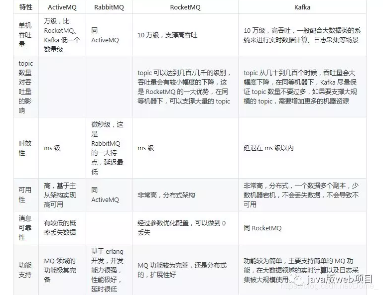

需要和面试官讲清楚的


采用Kafka解耦服务


Redis如何实现高可用的分布式锁，RedLock算法


一般的 MySQL，扛到每秒 2k 个请求就差不多了


如何搭建一个高可用的Redis集群


# redis的架构


 **单机版**


特点：简单

问题：

1、内存容量有限 2、处理能力有限 3、无法高可用。

**主从复制**

****

Redis 的复制（replication）功能允许用户根据一个 Redis 服务器来创建任意多个该服务器的复制品，其中被复制的服务器为主服务器（master），而通过复制创建出来的服务器复制品则为从服务器（slave）。 只要主从服务器之间的网络连接正常，主从服务器两者会具有相同的数据，主服务器就会一直将发生在自己身上的数据更新同步 给从服务器，从而一直保证主从服务器的数据相同。

特点：

1、master/slave 角色

2、master/slave 数据相同

3、降低 master 读压力在转交从库

问题：

无法保证高可用

没有解决 master 写的压力

**哨兵**

****

Redis sentinel 是一个分布式系统中监控 redis 主从服务器，并在主服务器下线时自动进行故障转移。其中三个特性：

监控（Monitoring）：    Sentinel  会不断地检查你的主服务器和从服务器是否运作正常。

提醒（Notification）： 当被监控的某个 Redis 服务器出现问题时， Sentinel 可以通过 API 向管理员或者其他应用程序发送通知。

自动故障迁移（Automatic failover）： 当一个主服务器不能正常工作时， Sentinel 会开始一次自动故障迁移操作。

特点：

1、保证高可用

2、监控各个节点

3、自动故障迁移

缺点：主从模式，切换需要时间丢数据

没有解决 master 写的压力

**集群（proxy 型）：**

****

Twemproxy 是一个 Twitter 开源的一个 redis 和 memcache 快速/轻量级代理服务器； Twemproxy 是一个快速的单线程代理程序，支持 Memcached ASCII 协议和 redis 协议。

特点：1、多种 hash 算法：MD5、CRC16、CRC32、CRC32a、hsieh、murmur、Jenkins 

2、支持失败节点自动删除

3、后端 Sharding 分片逻辑对业务透明，业务方的读写方式和操作单个 Redis 一致

缺点：增加了新的 proxy，需要维护其高可用。

 

failover 逻辑需要自己实现，其本身不能支持故障的自动转移可扩展性差，进行扩缩容都需要手动干预

**集群（直连型）：**

****

从redis 3.0之后版本支持redis-cluster集群，Redis-Cluster采用无中心结构，每个节点保存数据和整个集群状态,每个节点都和其他所有节点连接。

特点：

1、无中心架构（不存在哪个节点影响性能瓶颈），少了 proxy 层。

2、数据按照 slot 存储分布在多个节点，节点间数据共享，可动态调整数据分布。

3、可扩展性，可线性扩展到 1000 个节点，节点可动态添加或删除。

4、高可用性，部分节点不可用时，集群仍可用。通过增加 Slave 做备份数据副本

5、实现故障自动 failover，节点之间通过 gossip 协议交换状态信息，用投票机制完成 Slave到 Master 的角色提升。

缺点：

1、资源隔离性较差，容易出现相互影响的情况。

2、数据通过异步复制,不保证数据的强一致性


# redis实现消息队列


Redis list的实现为一个双向链表，即可以支持反向查找和遍历，更方便操作，不过带来了部分额外的内存开销，Redis内部的很多实现，包括发送缓冲队列等也都是用的这个数据结构。

lpush

rpop 非阻塞

brpop 阻塞


### 用redis的list当作队列可能存在的问题

1)redis崩溃的时候队列功能失效

2)如果入队端一直在塞数据，而出队端没有消费数据，或者是入队的频率大而多，出队端的消费频率慢会导致内存暴涨

3)Redis的队列也可以像rabbitmq那样  即可以做消息的持久化，也可以不做消息的持久化。

当做持久话的时候，需要启动redis的dump数据的功能.暂时不建议开启持久化。

 

Redis其实只适合作为缓存，而不是数据库或是存储。它的持久化方式适用于救救急啥的，不太适合当作一个普通功能来用。应为dump时候，会影响性能，数据量小的时候还看不出来，当数据量达到百万级别，内存10g左右的时候，非常影响性能。

 

4)假如有多个消费者同时监听一个队列，其中一个出队了一个元素，另一个则获取不到该元素

5)Redis的队列应用场景是一对多或者一对一的关系，即有多个入队端，但是只有一个消费端(出队)

# redis持久化

1. Redis 默认开启RDB持久化方式，在指定的时间间隔内，执行指定次数的写操作，则将内存中的数据写入到磁盘中。
2. RDB 持久化适合大规模的数据恢复但它的数据一致性和完整性较差。
3. Redis 需要手动开启AOF持久化方式，默认是每秒或者每当数据发生变化时将写操作日志追加到AOF文件中。
4. AOF 的数据完整性比RDB高，但记录内容多了，会影响数据恢复的效率。
5. Redis 针对 AOF文件大的问题，提供重写的瘦身机制。
6. 若只打算用Redis 做缓存，可以关闭持久化。
7. 若打算使用Redis 的持久化。建议RDB和AOF都开启。其实RDB更适合做数据的备份，留一后手。AOF出问题了，还有RDB。


# redis如何缓存

### Redis 配置

首先需要对 Redis 进行配置，主要是两个方面：内存最大使用量以及缓存淘汰策略。

内存最大使用量在服务器能接受的范围内越大越好，一般要比热点数据大一些，因为 Reids 不仅要用来存储数据，还有存 Redis 运行过程的数据。

Redis 有五种缓存淘汰策略，为了选择一种适合项目的策略，需要先对每种策略进行一个了解。

NoEviction 和 TTL（Time to Live）不适合本项目的缓存系统，因为不淘汰和根据过期时间进行淘汰都不能保证留在缓存中的数据都尽可能是热点数据。Random 也和过期时间相关，并且随机化策略无法保证热点数据。LRU（least recently used） 策略将最近最少使用的数据进行淘汰，最近使用次数多的数据被认为是热点数据，因此将最近最少使用的数据淘汰之后，能在很大程度上保证在缓存中的数据都是热点数据。

| 策略            | 描述                                                 |
| --------------- | ---------------------------------------------------- |
| volatile-lru    | 从已设置过期时间的数据集中挑选最近最少使用的数据淘汰 |
| volatile-ttl    | 从已设置过期时间的数据集中挑选将要过期的数据淘汰     |
| volatile-random | 从已设置过期时间的数据集中任意选择数据淘汰           |
| allkeys-lru     | 从所有数据集中挑选最近最少使用的数据淘汰             |
| allkeys-random  | 从所有数据集中任意选择数据进行淘汰                   |
| noeviction      | 禁止驱逐数据                                         |

LRU 除了在 Redis 中被当做缓存淘汰策略，它在很多场合都被使用，例如操作系统的页面置换算法可以使用 LRU，这是因为页面置换算法也相当于一个缓存淘汰算法。Java 里面的 LinkedHashMap 可以保存插入键值对的 LRU，在 Java 程序中就可以使用 LinkedHashMap 来实现类似的缓存淘汰功能。

实现 LRU 其实也很简单，就是通过一个链表来维护顺序，在访问一个元素时，就将元素移到链表头部，那么链表尾部的元素就是最近最少使用的元素，可以将它淘汰。


### 实现

为了实现缓存功能，需要修改获取微博和添加微博的实现代码。

在获取微博的代码中，首先从 Redis 中获取，如果获取失败就从数据库中获取。

其中 BlogCacheDao 实现了缓存的获取和添加功能，CacheHitDao 用来记录缓存的命中次数和未命中次数，这是为了对系统进行监控，从而对缓存进行优化，并且能够及时发现缓存穿透和缓存雪崩等问题。

在添加微博到数据库的同时也要将它添加到 Redis 中，这是因为数据库使用的是主从架构来实现的读写分离，主从同步过程需要一定的时间，这一段时间主备数据库是不一致的。如果读请求发送到从数据库，那么就无法读取到最新的数据。如果在写的同时将数据添加到缓存中，那么读最新数据的请求就不会发送到从服务器，从而避免了主备服务器在同步期间的不一致。


## 主从架构

### 主从复制

[](https://github.com/CyC2018/MBlog/blob/master/pics/5.png)

MySQL 主从复制主要涉及三个线程：binlog 线程、I/O 线程和 SQL 线程。

- **binlog 线程** ：负责将主服务器上的数据更改写入二进制文件（binlog）中。
- **I/O 线程** ：负责从主服务器上读取二进制日志文件，并写入中继日志中。
- **SQL 线程** ：负责读取中继日志并重放其中的 SQL 语句。

### 读写分离

[](https://github.com/CyC2018/MBlog/blob/master/pics/6.png)

主服务器用来处理写操作以及最新的读请求，而从服务器用来处理读操作。

读写分离常用代理方式来实现，代理服务器接收应用层传来的读写请求，然后决定转发到哪个服务器。

MySQL 读写分离能提高性能的原因在于：

- 主从服务器负责各自的读和写，极大程度缓解了锁的争用；
- 从服务器可以配置 MyISAM 引擎，提升查询性能以及节约系统开销；
- 增加冗余，提高可用性。


#### 创建复制账号

在主从服务器都创建用于复制的账号，并且账号必须在 master-host 和 slave-host 都进行授权，也就是说以下的命令需要在主从服务器上都执行一次。

```
mysql > grant all privileges on *.* to repl@'master-host' identified by 'password';
mysql > grant all privileges on *.* to repl@'slave-host' identified by 'password';
mysql > flush privileges;
```

完成后最好测试一下主从服务器是否能连通。

```
mysql -u repl -h host -p
```

#### 配置 my.cnf 文件

主服务器

```
[root]# vi /etc/my.cnf

[mysqld]
log-bin  = mysql-bin
server-id = 10
```

从服务器

```
[root]# vi /etc/my.cnf

[mysqld]
log-bin          = mysql-bin
server-id        = 11
relay-log        = /var/lib/mysql/mysql-relay-bin
log-slave-updates = 1
read-only         = 1
```

重启 MySQL

```
[root]# service mysqld restart;
```

《高性能 MySQL》书上的配置文件中使用的是下划线，例如 server_id，使用这种方式在当前版本的 MySQL 中不再生效。

#### 启动复制

先查看主服务器的二进制文件名：

```
mysql > show master status;
+------------------+----------+--------------+------------------+
| File            | Position | Binlog_Do_DB | Binlog_Ignore_DB |
+------------------+----------+--------------+------------------+
| mysql-bin.000002 |      106 |              |                  |
+------------------+----------+--------------+------------------+
```

然后配置从服务器：

```
mysql > change master to master_host='master-host',            > master_user='repl',
      > master_password='password',
      > master_log_file='mysql-bin.000002',
      > master_log_pos=0;
```

在从服务器上启动复制：

```
mysql > start slave
```

查看复制状态，Slave_IO_Running 和 Slave_SQL_Running 必须都为 Yes 才表示成功。

```
mysql > show slave status\G;
*************************** 1. row ***************************
              Slave_IO_State: Waiting for master to send event
                  Master_Host:
                  Master_User: repl
                  Master_Port: 3306
                Connect_Retry: 60
              Master_Log_File: mysql-bin.000002
          Read_Master_Log_Pos: 106
              Relay_Log_File: mysql-relay-bin.000006
                Relay_Log_Pos: 251
        Relay_Master_Log_File: mysql-bin.000002
            Slave_IO_Running: Yes
            Slave_SQL_Running: Yes
            ...
```

如何实现一致性hash算法，虚拟节点


NIO如何说清楚。

测试的并发量


RPC机制实现要注意什么


SOA架构

doubbo

ZooKeeper


消息队列有什么优缺点
优点上面已经说了，就是在特殊场景下有其对应的好处，解耦、异步、削峰。

缺点有以下几个：

1.系统可用性降低
系统引入的外部依赖越多，越容易挂掉。本来你就是 A 系统调用 BCD 三个系统的接口就好了，人 ABCD 四个系统好好的，没啥问题，你偏加个 MQ 进来，万一 MQ 挂了咋整，MQ 一挂，整套系统崩溃的，你不就完了？

2.系统复杂度提高
硬生生加个 MQ 进来，你怎么保证消息没有重复消费？怎么处理消息丢失的情况？怎么保证消息传递的顺序性？头大头大，问题一大堆，痛苦不已。

3.一致性问题
A 系统处理完了直接返回成功了，人都以为你这个请求就成功了；但是问题是，要是 BCD 三个系统那里，BD 两个系统写库成功了，结果 C 系统写库失败了，咋整？你这数据就不一致了。

所以消息队列实际是一种非常复杂的架构，你引入它有很多好处，但是也得针对它带来的坏处做各种额外的技术方案和架构来规避掉，做好之后，你会发现，妈呀，系统复杂度提升了一个数量级，也许是复杂了 10 倍。但是关键时刻，用，还是得用的。
————————————————
版权声明：本文为CSDN博主「KillCode」的原创文章，遵循 CC 4.0 BY-SA 版权协议，转载请附上原文出处链接及本声明。
原文链接：https://blog.csdn.net/Dome_/article/details/84990563




# Kafka


实时性数据管道---消息队列


Producer发布topic

Consumer订阅topic

Stream  将输入的流转化成输出流

Connector 运行可重复利用的Processor和Consumer，相当于一个连接池？


消费者组模型

分区内可保证顺序

不同区可保证并行处理

正像传统的消息系统一样，Kafka保证消息的顺序不变。 再详细扯几句。传统的队列模型保持消息，并且保证它们的先后顺序不变。但是， 尽管服务器保证了消息的顺序，消息还是异步的发送给各个消费者，消费者收到消息的先后顺序不能保证了。这也意味着并行消费将不能保证消息的先后顺序。用过传统的消息系统的同学肯定清楚，消息的顺序处理很让人头痛。如果只让一个消费者处理消息，又违背了并行处理的初衷。 在这一点上Kafka做的更好，尽管并没有完全解决上述问题。 Kafka采用了一种分而治之的策略：分区。 因为Topic分区中消息只能由消费者组中的唯一一个消费者处理，所以消息肯定是按照先后顺序进行处理的。但是它也仅仅是保证Topic的一个分区顺序处理，不能保证跨分区的消息先后处理顺序。 所以，如果你想要顺序的处理Topic的所有消息，那就只提供一个分区。


## 读写线程的分开

拓展性差，无法添加消息队列

分工不明确


发送之前或之后加其他的机制，

Reader和Writer都实现了Runnable接口，Reader负责读，读取了之后 往任务队列放入写任务，Writer负责写


## Zero-Copy

改进后的处理过程如下：

1. 将文件拷贝到kernel buffer中；
2. 向socket buffer中追加当前要发生的数据在kernel buffer中的位置和偏移量；
3. 根据socket buffer中的位置和偏移量直接将kernel buffer的数据copy到网卡设备（protocol engine）中；

经过上述过程，数据只经过了2次copy就从磁盘传送出去了。这个才是真正的Zero-Copy(这里的零拷贝是针对kernel来讲的，数据在kernel模式下是Zero-Copy)。

Zero-Copy技术的使用场景有很多，比如Kafka, 又或者是Netty等，可以大大提升程序的性能。

